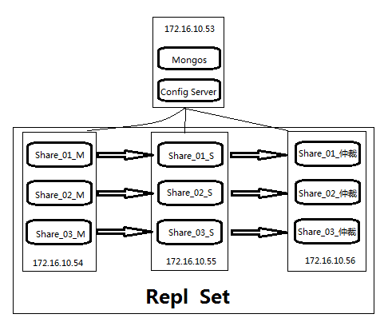

> MongoDB 的命令对大小写是比较敏感的，所以，注意命令大小写问题：

##一、MongoDB 集群分片的组成：
mongodb 的集群分片包括 4 个部分：mongos、config server、shard、replica set。
- **mongos :**   
    数据库集群请求的入口，所有的请求都通过mongos进行协调，不需要在应用程序添加一个路由选择器；
    mongos自己就是一个请求分发中心，它负责把对应的数据请求请求转发到对应的shard服务器上；
    在生产环境，通常有多mongos作为请求的入口，防止其中一个挂掉所有的mongodb请求都没有办法操作。
- **config server：**       
    顾名思义为配置服务器，存储所有数据库元信息（路由、分片）的配置；
    mongos本身没有物理存储分片服务器和数据路由信息，只是缓存在内存里，配置服务器则实际存储这些数据；
    mongos第一次启动或者关掉重启就会从 config server 加载配置信息，以后，如果配置服务器信息变化会通知到所有的 mongos 更新自己的状态；
    这样， mongos 就能继续准确路由；
    在生产环境通常有多个 config server 配置服务器，因为它存储了分片路由的元数据，这个可不能丢失！就算挂掉其中一台，只要还有存货， mongodb集群就不会挂掉。
- **shard**：
    这就是传说中的分片了。
    一台机器的一个数据表 Collection1 存储了 1T 数据，压力太大了；
    在分给4个机器后，每个机器都是256G，则分摊了集中在一台机器的压力；
    也许有人问一台机器硬盘加大一点不就可以了，为什么要分给四台机器呢？不要光想到存储空间，实际运行的数据库还有硬盘的读写、网络的IO、CPU和内存的瓶颈；
    在mongodb集群只要设置好了分片规则，通过mongos操作数据库就能自动把对应的数据操作请求转发到对应的分片机器上；
    在生产环境中分片的片键可要好好设置，这个影响到了怎么把数据均匀分到多个分片机器上，不要出现其中一台机器分了1T，其他机器没有分到的情况，这样还不如不分片！
- **replica set**：
    分片如果没有 replica set 是个不完整架构；
    假设，其中的一个分片挂掉那四分之一的数据就丢失了，所以，在高可用性的分片架构，还需要对于每一个分片构建 replica set 副本集保证分片的可靠性;
    生产环境通常是 2个副本 + 1个仲裁。
          
##二、MongoDB 集群分片部署规划和集群架构图：

1. 机器或实例数量：
下面，我们确定一下，机器的大体数量：
    mongos 3个， config server 3个，数据分3片 shard server 3个，每个shard 有一个副本一个仲裁也就是 3 * 2 = 6 个，总共需要部署15个实例。 但是，我们这里只是模拟测试，就准备 4 台机器：172.16.10.53；172.16.10.54；172.16.10.55；172.16.10.56；
2. 实例端口配置部分：
    这里，由于有的实例部署在同一台机器上，所以进行了端口规划：
    mongos：          20000
    config server：   21000
    shard1：             22001
    shard2：             22002
    shard3：             22003
3. MongoDB 集群分片架构图：
     


## 三、MongoDB 集群分片部署
1.MongoDB 部署：
    默认，已经初始安装好了，安装在 /usr/local/mongodb
2.MongoDB 多实例 部署：

以下操作，在 172.16.10.54，172.16.10.55 上执行

(1).新建 MongoDB分片 的 data 目录：（切换到 mongodb 用户下，新建目录）
        mkdir -p   /usr/local/mongodb/data/share_0{1..3}
(2).在conf 目录，新建并编辑 3份 配置文件（可用root用户新建编辑）
```
        vim  /usr/local/mongodb/conf/mongodb_01.conf
            port=22001
            dbpath=/usr/local/mongodb/data/share_01
            logpath=/usr/local/mongodb/log/mongodb_01.log
            logappend=true
            fork=true
            oplogSize=4096
            # replSet=share_01/172.16.10.56:22001,172.16.10.55:22001   # 在10.54 上配置文件，去掉此行前面的注释
            # replSet=share_01/172.16.10.56:22001,172.16.10.54:22001   # 在10.55 上配置文件，去掉此行前面的注释
        vim  /usr/local/mongodb/conf/mongodb_02.conf
            port=22002
            dbpath=/usr/local/mongodb/data/share_02
            logpath=/usr/local/mongodb/log/mongodb_02.log
            logappend=true
            fork=true
            oplogSize=4096
            # replSet=share_02/172.16.10.56:22002,172.16.10.55:22002   # 在10.54 上配置文件，去掉此行前面的注释
            # replSet=share_02/172.16.10.56:22002,172.16.10.54:22002   # 在10.55 上配置文件，去掉此行前面的注释
        vim  /usr/local/mongodb/conf/mongodb_03.conf
            port=22003
            dbpath=/usr/local/mongodb/data/share_03
            logpath=/usr/local/mongodb/log/mongodb_03.log
            logappend=true
            fork=true
            oplogSize=4096
            # replSet=share_03/172.16.10.56:22003,172.16.10.55:22003   # 在10.54 上配置文件，去掉此行前面的注释
            # replSet=share_03/172.16.10.56:22003,172.16.10.54:22003   # 在10.55 上配置文件，去掉此行前面的注释
```
(3).MongoDB 启动测试：
```
        # 切换用户：
      
        su - mongodb
     
        # 启动：
       
        /usr/local/mongodb/bin/mongod --config /usr/local/mongodb/conf/mongodb_01.conf
        /usr/local/mongodb/bin/mongod --config /usr/local/mongodb/conf/mongodb_02.conf
        /usr/local/mongodb/bin/mongod --config /usr/local/mongodb/conf/mongodb_03.conf
        
        # 查看是否启动：
            ps -ef | grep mongodb   或    netstat -tulnap | grep mongo
            ```
            
3.MongoDB 仲裁配置：【 这个操作在 172.16.10.56 】
(1).MongoDB 仲裁的安装：
        MongoDB arbiter 安装  和 mongodb 的安装一样(请参照mongodb安装)，只需要修改一下配置文件；
        我们，这里修改 mongodb 仲裁的名字叫 mongodb_arbiter，安装在 /usr/local/mongodb_arbiter 目录下；
(2).MongoDB 仲裁多实例部署 和 上面 mongodb 的多实例部署一致：
        新建 MongoDB的 data 目录：（切换到 mongodb 用户下，新建目录）
        mkdir -p   /usr/local/mongodb/data/arbiter_0{1..3}
(3).在conf 目录，新建并编辑 3份 配置文件（可用root用户新建编辑）
```
        vim /usr/local/mongodb_arbiter/conf/mongodb_01.conf
            port=22001
            dbpath=/usr/local/mongodb_arbiter/data/arbiter_01
            logpath=/usr/local/mongodb_arbiter/log/arbiter_01.log
            logappend=true
            fork=true
            replSet=share_01/172.16.10.54:22001,172.16.10.55:22001
        vim /usr/local/mongodb_arbiter/conf/mongodb_02.conf
            port=22002
            dbpath=/usr/local/mongodb_arbiter/data/arbiter_02
            logpath=/usr/local/mongodb_arbiter/log/arbiter_02.log
            logappend=true
            fork=true
            replSet=share_02/172.16.10.54:22002,172.16.10.55:22002
        vim /usr/local/mongodb_arbiter/conf/mongodb_03.conf
            port=22003
            dbpath=/usr/local/mongodb_arbiter/data/arbiter_03
            logpath=/usr/local/mongodb_arbiter/log/arbiter_03.log
            logappend=true
            fork=true
            replSet=share_03/172.16.10.54:22003,172.16.10.55:22003
```
(4).mongodb_arbiter启动：
```
        /usr/local/mongodb_arbiter/bin/mongod --config /usr/local/mongodb_arbiter/conf/mongodb_01.conf
        /usr/local/mongodb_arbiter/bin/mongod --config /usr/local/mongodb_arbiter/conf/mongodb_02.conf
        /usr/local/mongodb_arbiter/bin/mongod --config /usr/local/mongodb_arbiter/conf/mongodb_03.conf
```
4.MongoDB 备份集配置：
```
    # 修改 172.16.10.54，172.16.10.55  三个 mongodb 实例的 配置：
    # 注：
            修改的部分，就是实例 注释掉的部分，根据需要，去掉需要部分前面的“ # ” ，重启即可；
    # 以上配置修改完成后，需要重启 54，55 上的实例；
    # 在 仲裁端 登录，初始化副本集：
        登录到172.16.10.54：22001 （mongodb master）上，执行如下操作：
                /usr/local/mongodb/bin/mongo --port 22001
                /usr/local/mongodb/bin/mongo>use admin
                /usr/local/mongodb/bin/mongo>config_share01={_id:'share_01',members:[
                                                                                                {_id:0,host:'172.16.10.54:22001',priority:10},
                                                                                                {_id:1,host:'172.16.10.55:22001',priority:9},
                                                                                                {_id:2,host:'172.16.10.56:22001',"arbiterOnly":true} ]}
                /usr/local/mongodb/bin/mongo>rs.initiate(config_share01)
                /usr/local/mongodb/bin/mongo>rs.status()
                /usr/local/mongodb/bin/mongo>rs.config()
    # 其它实例，修改 红色部分端口，和分片号； 这里就不做副本集测试
 ```   
 
5.MongoDB config 服务 和 mongos(路由) 服务部署：

```
#   在172.16.10.53 上部署；
#   配置服务和路由服务的安装，只需要正常安装mongodb， 修改相应的配置文件即可：
#   新建配置服务数据目录（以mongodb身份新建）
        mkdir -p /usr/local/mongodb/data/config_server
```
(1).修改 MongoDB  配置服务器的配置文件：
```
        vim /usr/local/mongodb/conf/config_server.conf
        pidfilepath = /usr/local/mongodb/config/mongodb_config.pid 
        logpath =/usr/local/mongodb/log/config_server.log  
        dbpath = /usr/local/mongodb/data/config_server
        directoryperdb = true  
        configsvr = true  
        port = 21000  
        logappend = true  
        fork = true 
```
(2).修改 MongoDB  路由服务器的配置文件：
```
        vim /usr/local/mongodb/conf/mongos.conf
        # 监听的配置服务器,只能有1个或者3个
        configdb = 172.168.10.53:21000   
        port = 20000  
        # 单位 mb 生成环境请使用 100 或删除,删除后默认是64
        chunkSize = 1 
        logpath =/usr/local/mongodb/log/mongos.log  
        logappend = true  
        fork = true
        ```  
(3).启动配置服务器和路由服务器：
        A.配置服务器的启动：
        ```
            /usr/local/mongodb/bin/mongod --config /usr/local/mongodb/conf/config_server.conf
            ```
        B.路由服务器的启动：
        ```
            /usr/local/mongodb/bin/mongos --config /usr/local/mongodb/conf/mongos.conf
            ```
6.MongoDB 路由节点配置：
```
    /usr/local/mongodb/bin/mongo --port 20000
    mongos> use admin
    mongos> db.runCommand({addshard:"share_02/172.16.10.54:22002,172.16.10.55:22002,172.16.10.56:22002",name:"share_02",maxsize:20480})
    mongos> db.runCommand({addshard:"share_01/172.16.10.54:22001,172.16.10.55:22001,172.16.10.56:22001",name:"share_01",maxsize:20480})
mongos> db.runCommand({addshard:"share_03/172.16.10.54:22003,172.16.10.55:22003,172.16.10.56:22003",name:"share_03",maxsize:20480})
mongos> db.runCommand({listshards:1})
        {
    "shards" : [
{
"_id" : "share_02",
"host" : "share_02/172.16.10.54:22002,172.16.10.55:22002"
},
{
"_id" : "share_01",
"host" : "share_01/172.16.10.54:22001,172.16.10.55:22001"
},
{
"_id" : "share_03",
"host" : "share_03/172.16.10.54:22003,172.16.10.55:22003"
}
    ],
    "ok" : 1
        }
        ```
        #  注：
                replica set + shard 功能就配置好了，注意：虽然配置好了，但是还要声明库和表要进行分片
7.MongoDB 声明库 和 表 分片：
```
    mongos> use admin  # 切换到admin库
    mongos> db.runCommand({enablesharding:"test2"});   # 声明test2库允许分片
    mongos> db.runCommand( { shardcollection : "test2.books", key : { id : 1 } } );   # 声明books表要分片
    mongos> use test2    # 切换到test2
    mongos> db.stats();   # 查看数据库状态
    mongos> db.books.stats();   # 查看表状态
    ```
##四、MongoDB 集群分片测试：

     1.测试脚本：
          mongos> for ( var i=1;i<=20000;i++) db.books.save({id:i,name:"haowu",sex:"male",age:28,value:"haowu"});
     2.测试结果：
          (1).这个插入分片数据前的信息：
```        
mongos> db.books.stats();
{
"sharded" : true,
"paddingFactorNote" : "paddingFactor is unused and unmaintained in 3.0. It remains hard coded to 1.0 for compatibility only.",
"userFlags" : 1,
"capped" : false,
"ns" : "test2.books",
"count" : 0,
"numExtents" : 1,
"size" : 0,
"storageSize" : 8192,
"totalIndexSize" : 16352,
"indexSizes" : {
"_id_" : 8176,
"id_1" : 8176
},
"avgObjSize" : 0,
"nindexes" : 2,
"nchunks" : 1,
"shards" : {
"share_01" : {
"ns" : "test2.books",
"count" : 0,
"size" : 0,
"numExtents" : 1,
"storageSize" : 8192,
"lastExtentSize" : 8192,
"paddingFactor" : 1,
"paddingFactorNote" : "paddingFactor is unused and unmaintained in 3.0. It remains hard coded to 1.0 for compatibility only.",
"userFlags" : 1,
"capped" : false,
"nindexes" : 2,
"totalIndexSize" : 16352,
"indexSizes" : {
"_id_" : 8176,
"id_1" : 8176
},
"ok" : 1,
"$gleStats" : {
"lastOpTime" : Timestamp(0, 0),
"electionId" : ObjectId("5551b02945399f93109d3a39")
}
}
},
"ok" : 1
}
```
(2). 这个插入分片数据后的信息：
```
mongos> db.books.stats();
{
"sharded" : true,
"paddingFactorNote" : "paddingFactor is unused and unmaintained in 3.0. It remains hard coded to 1.0 for compatibility only.",
"userFlags" : 1,
"capped" : false,
"ns" : "test2.books",
"count" : 20000,
"numExtents" : 11,
"size" : 2240000,
"storageSize" : 5595136,
"totalIndexSize" : 1267280,
"indexSizes" : {
          "_id_" : 678608,
"id_1" : 588672
},
"avgObjSize" : 112,
"nindexes" : 2,
"nchunks" : 5,
"shards" : {
"share_01" : {
"ns" : "test2.books",
    "count" : 10028,
"size" : 1123136,
"avgObjSize" : 112,
"numExtents" : 5,
"storageSize" : 2793472,
"lastExtentSize" : 2097152,
"paddingFactor" : 1,
"paddingFactorNote" : "paddingFactor is unused and unmaintained in 3.0. It remains hard coded to 1.0 for compatibility only.",
"userFlags" : 1,
"capped" : false,
"nindexes" : 2,
"totalIndexSize" : 629552,
"indexSizes" : {
"_id_" : 335216,
"id_1" : 294336
},
"ok" : 1,
"$gleStats" : {
"lastOpTime" : Timestamp(0, 0),
"electionId" : ObjectId("5551b02945399f93109d3a39")
}
},
"share_02" : {
"ns" : "test2.books",
    "count" : 9964,
"size" : 1115968,
"avgObjSize" : 112,
"numExtents" : 5,
"storageSize" : 2793472,
"lastExtentSize" : 2097152,
"paddingFactor" : 1,
"paddingFactorNote" : "paddingFactor is unused and unmaintained in 3.0. It remains hard coded to 1.0 for compatibility only.",
"userFlags" : 1,
"capped" : false,
"nindexes" : 2,
"totalIndexSize" : 621376,
"indexSizes" : {
"_id_" : 335216,
"id_1" : 286160
},
"ok" : 1,
"$gleStats" : {
"lastOpTime" : Timestamp(0, 0),
"electionId" : ObjectId("5551af01cfe537190558b164")
}
},
"share_03" : {
"ns" : "test2.books",
        "count" : 8,
"size" : 896,
"avgObjSize" : 112,
"numExtents" : 1,
"storageSize" : 8192,
"lastExtentSize" : 8192,
"paddingFactor" : 1,
"paddingFactorNote" : "paddingFactor is unused and unmaintained in 3.0. It remains hard coded to 1.0 for compatibility only.",
"userFlags" : 1,
"capped" : false,
"nindexes" : 2,
"totalIndexSize" : 16352,
"indexSizes" : {
"_id_" : 8176,
"id_1" : 8176
},
"ok" : 1,
"$gleStats" : {
"lastOpTime" : Timestamp(0, 0),
"electionId" : ObjectId("5551af39bc340be250ae0cb4")
}
}
},
"ok" : 1
}
```
> 注：从上面看，我们这个插入的数据，分配很不均衡，至于何解，有待研究
    
3.集群分片信息的查看：
```
mongos> sh.status();
--- Sharding Status ---
sharding version: {
"_id" : 1,
"minCompatibleVersion" : 5,
"currentVersion" : 6,
"clusterId" : ObjectId("5551bfe62d6d99e8bbbc8840")
}
shards:
{  "_id" : "share_01",  "host" : "share_01/172.16.10.54:22001,172.16.10.55:22001" }
{  "_id" : "share_02",  "host" : "share_02/172.16.10.54:22002,172.16.10.55:22002" }
{  "_id" : "share_03",  "host" : "share_03/172.16.10.54:22003,172.16.10.55:22003" }
balancer:
Currently enabled:  yes
Currently running:  no
Failed balancer rounds in last 5 attempts:  0
Migration Results for the last 24 hours:
3 : Success
1 : Failed with error 'migration already in progress', from share_01 to share_02
databases:
{  "_id" : "admin",  "partitioned" : false,  "primary" : "config" }
{  "_id" : "test",  "partitioned" : false,  "primary" : "share_01" }
{  "_id" : "test2",  "partitioned" : true,  "primary" : "share_01" }
test2.books
shard key: { "id" : 1 }
chunks:
share_01     2
share_02     2
share_03     1
{ "id" : { "$minKey" : 1 } } -->> { "id" : 2 } on : share_02 Timestamp(2, 0)
{ "id" : 2 } -->> { "id" : 10 } on : share_03 Timestamp(3, 0)
{ "id" : 10 } -->> { "id" : 4691 } on : share_01 Timestamp(4, 1)
{ "id" : 4691 } -->> { "id" : 10038 } on : share_01 Timestamp(3, 3)
{ "id" : 10038 } -->> { "id" : { "$maxKey" : 1 } } on : share_02 Timestamp(4, 0)
```